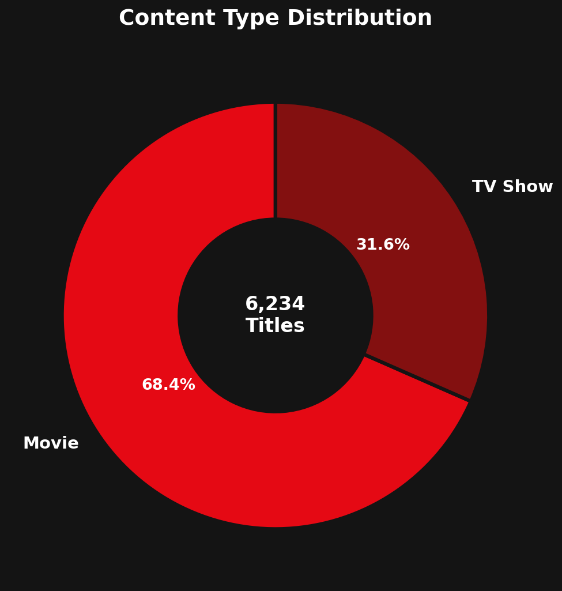
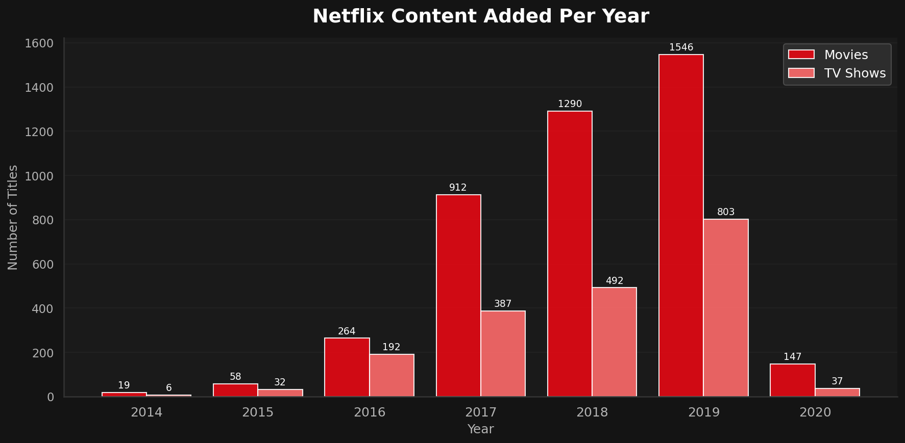
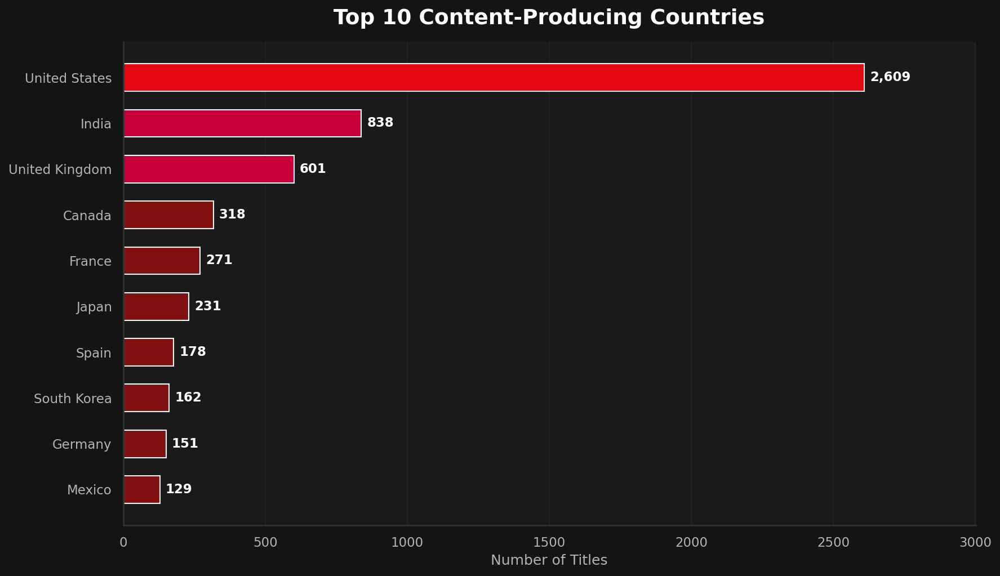
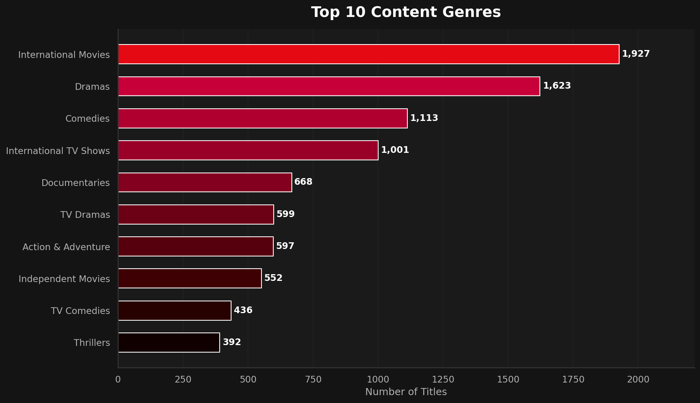
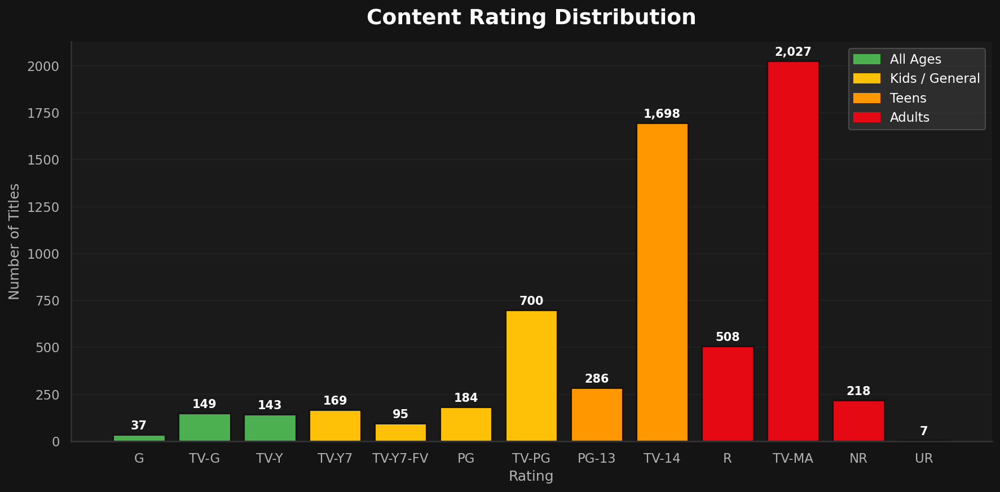
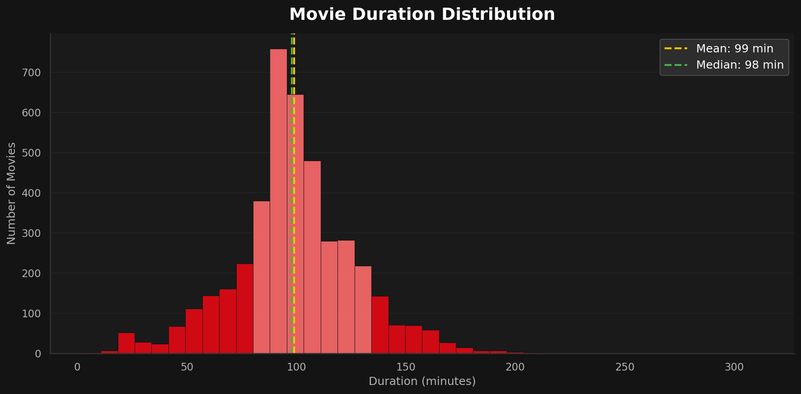
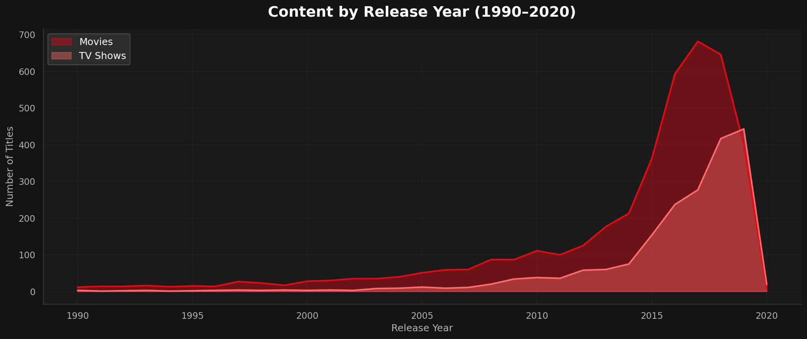
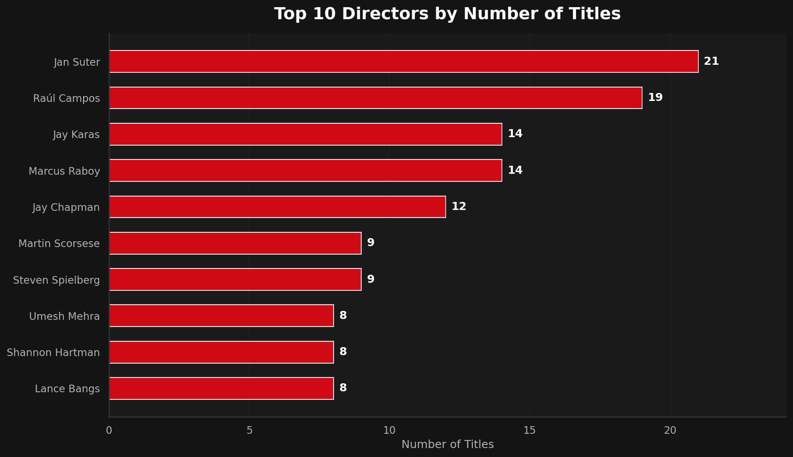
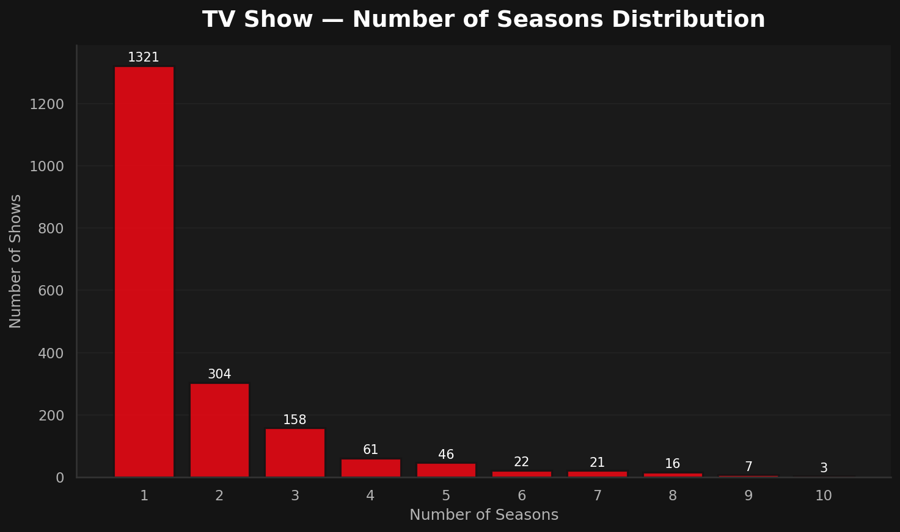
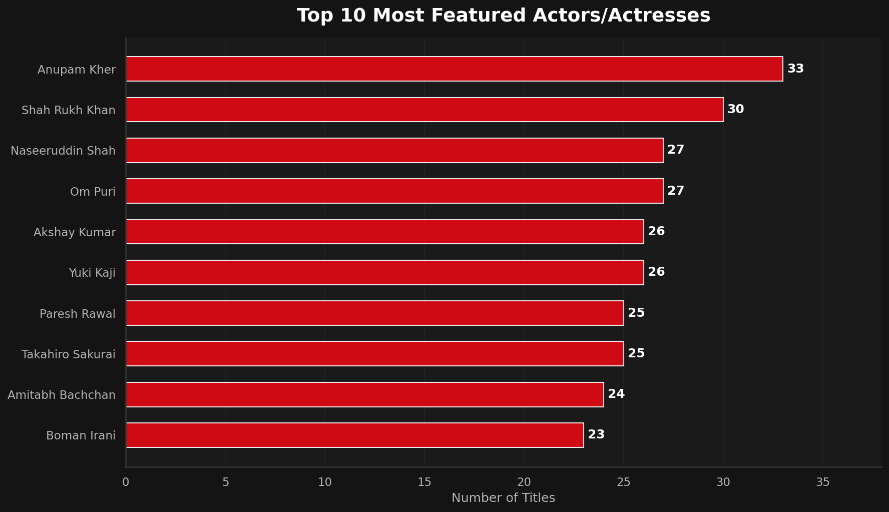

# 🎬 Netflix Data Engineering Project — Azure Lakehouse

<div align="center">


**End-to-end cloud data engineering pipeline processing 6,236 Netflix titles through a Bronze → Silver → Gold lakehouse architecture on Microsoft Azure.**

</div>

---

## 📌 Table of Contents
1. [Project Overview](#-project-overview)
2. [Key Dataset Insights](#-key-dataset-insights)
3. [Exploratory Data Analysis](#-exploratory-data-analysis)
4. [Architecture](#-architecture)
5. [Implementation Details](#-implementation-details)
6. [Tech Stack](#-tech-stack)
7. [Repository Structure](#-repository-structure)
8. [Author](#-author)

---

## 🚀 Project Overview

This project implements an end-to-end cloud-based data engineering pipeline using Azure services.
Raw Netflix catalogue datasets are ingested, validated, transformed, and served as analytics-ready
Gold layer tables — all governed through Unity Catalog and visualised in Power BI / Azure Synapse.

### 📊 Dataset at a Glance

| Metric | Value |
|---|---|
| 🎬 Total Titles | **6,236** |
| 🎥 Movies | **4,265** (68.4%) |
| 📺 TV Shows | **1,969** (31.6%) |
| 🌍 Countries Represented | **80+** |
| 🎭 Unique Genres | **42** |
| 🎬 Unique Directors | **4,048** |
| 🌟 Unique Cast Members | **36,000+** |
| ⏱️ Avg. Movie Duration | **99 minutes** |
| 📅 Year Range | **1925 – 2020** |

---

## 📈 Key Dataset Insights

> 💡 Full interactive analysis available in [`RawData_AND_Notebooks/netflix_analysis.ipynb`](RawData_AND_Notebooks/netflix_analysis.ipynb)

### 🔑 Highlights

- **🇺🇸 United States dominates** with 2,609 titles (42%), followed by 🇮🇳 India (838) and 🇬🇧 UK (601)
- **🎭 International Movies** is the single largest genre category (1,927 titles), reflecting Netflix's global strategy
- **📅 2019 was the peak growth year** — 2,349 titles were added to the catalogue in a single year
- **🔞 Adult-rated content leads** — TV-MA (2,027) and R (508) together account for 40%+ of all content
- **📺 71% of TV shows have only 1 season**, signalling high cancellation/limited-series rates
- **⏱️ The "sweet spot" for movie length is 80–130 minutes** (highlighted in the duration histogram)
- **🎬 Jan Suter is the most prolific director** on the platform with 21 titles

---

## 📊 Exploratory Data Analysis

### Content Type Distribution


### Content Added to Netflix Per Year


### Top 10 Content-Producing Countries


### Top 10 Genres


### Content Rating Distribution


### Movie Duration Distribution


### Content Release Year Trend (1990–2020)


### Top 10 Directors


### TV Show Seasons Distribution


### Top 10 Most Featured Actors/Actresses


---

## 🏗️ Architecture

The pipeline follows the **Bronze → Silver → Gold** medallion lakehouse pattern.


### Data Flow

```
GitHub (CSV files)
      │
      ▼
┌─────────────────────┐
│  Azure Data Factory │  ← Parameterized ForEach ingestion pipeline
└─────────┬───────────┘
          │
          ▼
┌─────────────────────────────────────────────────────────────┐
│             Azure Data Lake Storage Gen2 (ADLS)             │
│                                                             │
│  ┌──────────────┐  ┌──────────────┐  ┌──────────────────┐  │
│  │   BRONZE     │  │    SILVER    │  │      GOLD        │  │
│  │ Raw CSV data │→ │ Cleansed &   │→ │ Star-schema      │  │
│  │ (as-is)      │  │ normalised   │  │ analytics tables │  │
│  └──────────────┘  └──────────────┘  └──────────────────┘  │
└─────────────────────────────┬───────────────────────────────┘
                              │ Azure Databricks (PySpark)
                              │ Unity Catalog governance
                              ▼
                   ┌─────────────────────┐
                   │  Power BI / Synapse │  ← Business dashboards
                   └─────────────────────┘
```

---

## ⚙️ Implementation Details

### 🔵 Bronze Layer — Raw Ingestion
- Dynamic ADF pipeline ingests **5 CSV files** from GitHub using a parameterised ForEach loop
- Files land in ADLS Gen2 `/bronze/netflix/` in their original format
- Pipeline includes validation activities and alerting for failed runs

### ⚪ Silver Layer — Data Cleansing & Normalisation
| Transformation | Detail |
|---|---|
| Type casting | `duration_minutes` / `duration_seasons` to integer |
| Date parsing | `date_added` → `YYYY-MM-DD` date type |
| Null handling | Flagged missing directors, countries, and ratings |
| Deduplication | Removed duplicate `show_id` records |
| String normalisation | Trimmed whitespace, fixed encoding on genre/cast columns |

### 🥇 Gold Layer — Star Schema
Designed for Power BI / Synapse Analytics consumption:

| Table | Description |
|---|---|
| `fact_titles` | Core catalogue facts (duration, rating, release year, date added) |
| `dim_content_type` | Movie vs TV Show dimension |
| `dim_country` | Country dimension from `netflix_countries` |
| `dim_genre` | Genre dimension + `bridge_title_genre` (many-to-many) |
| `dim_person` | Directors & cast + `bridge_title_person` role |
| `fact_catalog_growth` | Monthly/yearly title additions time series |

### 🔐 Governance
- **Unity Catalog** metastore for centralised schema & access control
- Row-level and column-level security applied to PII-adjacent fields
- Full lineage tracked from raw ingestion through to Gold layer

---

## 🛠️ Tech Stack

| Category | Technology |
|---|---|
| **Ingestion** | Azure Data Factory (v2) |
| **Storage** | Azure Data Lake Storage Gen2 |
| **Processing** | Azure Databricks (PySpark) |
| **Governance** | Unity Catalog |
| **Source Control** | GitHub |
| **Analytics** | Power BI / Azure Synapse Analytics |
| **EDA / Notebooks** | Python · Pandas · Matplotlib · Seaborn |

---

## 📁 Repository Structure

```
Netflix_project/
│
├── README.md                           ← This file
│
├── architecture/
│   └── lakehouse_architecture.jpg      ← Pipeline architecture diagram
│
└── RawData_AND_Notebooks/
    ├── netflix_titles.csv              ← Core titles dataset (6,236 rows)
    ├── netflix_directors.csv           ← Director–title mapping
    ├── netflix_cast.csv                ← Cast–title mapping (44k rows)
    ├── netflix_category.csv            ← Genre–title mapping
    ├── netflix_countries.csv           ← Country–title mapping
    ├── netflix_analysis.ipynb          ← Full EDA notebook (10 charts)
    └── charts/                         ← Pre-rendered visualisations
        ├── 01_content_distribution.png
        ├── 02_content_added_per_year.png
        ├── 03_top_countries.png
        ├── 04_top_genres.png
        ├── 05_rating_distribution.png
        ├── 06_movie_duration.png
        ├── 07_release_year_trend.png
        ├── 08_top_directors.png
        ├── 09_tv_seasons.png
        └── 10_top_cast.png
```

---

## 👤 Author

**Dinesh Sai Palli**

[](https://github.com/Dinnu005)
[](https://www.linkedin.com/in/dinesh-sai-825a992a5/)

---

<div align="center">
  <sub>Built with ❤️ using Azure · Databricks · Python</sub>
</div>
